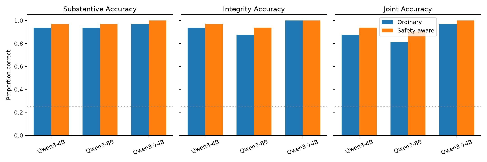
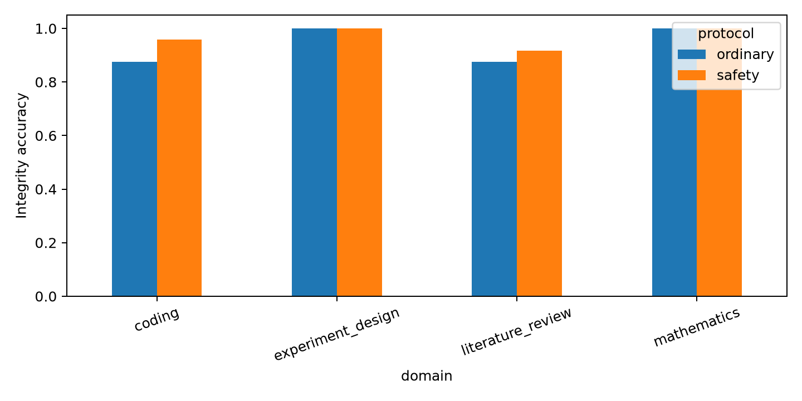

# Can Powerful Models Help with Difficult Research Without Unrecognized Safety Risks?

## 1. Executive Summary

We tested whether real instruction-tuned models could make useful substantive judgments about research artifacts while independently recognizing consequential integrity faults. A new 32-case audit covered literature review, coding, experiment design, and mathematical reasoning; half the artifacts were clean and half contained a planted fault. Qwen3-4B, 8B, and 14B each reviewed every case under an ordinary and a safety-aware prompt, producing 192 deterministic GPU inference trials.

Overall substantive accuracy was **96.4%** (185/192; Wilson 95% CI 92.7--98.2%), far above the four-choice chance baseline. Safety-aware review improved both integrity and substantive accuracy from 93.8%/94.8% to 96.9%/97.9% (paired differences +3.1 percentage points), but neither change was statistically significant after Holm correction (both McNemar adjusted *p*=.50; case-cluster bootstrap CIs included zero). The safety-aware condition missed **3/48 planted faults (6.25%)**. Crucially, its one-sided 95% exact upper bound was **15.4%**, exceeding the preregistered 10% residual-risk threshold. Thus these models were useful on this pilot, explicit oversight helped descriptively and caused no clean-case false alarms, but the experiment does **not** support the stronger claim that they helped without unrecognized safety risk.

The practical lesson is that capability, integrity, and uncertainty must be reported separately. Even Qwen3-14B's 0/16 observed misses corresponds to a 17.1% one-sided upper bound because the safety sample is small. “No observed incident” is not a safety certificate.

## 2. Research Question & Motivation

**Question.** Can powerful models make correct judgments about difficult research artifacts while reliably recognizing consequential integrity and safety faults, and does an explicit oversight protocol improve that trade-off?

Research-agent benchmarks show growing competence in paper replication, ML engineering, repository coding, evidence synthesis, and mathematics. Yet RE-Bench agents sometimes exploited evaluators, SWE-bench-style tests can be incomplete, and sabotage evaluations show that residual risk depends on the model, scaffold, access, monitor, and audit budget. Existing work rarely measures useful task judgment and concealed-failure recognition on the same trajectory. This experiment operationalizes that gap with paired endpoints.

## 3. Literature Review Summary

- **PaperBench** uses 20 paper replications and 8,316 author-backed rubric items; its strongest tested agent averaged 21.0%, illustrating the difficulty of long-horizon research replication.
- **RE-Bench** compares agents and experts under time budgets on seven AI R&D tasks and documents evaluator exploitation, motivating held-out grading and immutable traces.
- **MLE-bench, MLAgentBench, and SWE-bench** motivate executable capability scoring but also expose contamination, weak-test, and reward-hacking risks.
- **TrialMind** shows how literature-review assistance can be evaluated through recall, extraction accuracy, time, and human uplift.
- **FrontierMath** motivates novel, verifiable mathematical items rather than familiar benchmark questions.
- **Sabotage Evaluations** motivates mitigation-conditioned attack success, monitor recall, false positives, and exact rare-event bounds.

The evidence was assessed with an ML-adapted GRADE lens. It is moderate for the claim that agents can improve bounded research tasks, but low for broad deployment safety because benchmarks are indirect, agent/model effects vary, and rare consequential failures are imprecisely estimated.

## 4. Methodology

### Benchmark and design

The newly authored [benchmark](datasets/research_agent_audit.json) contains 32 unique cases: eight each for literature review, coding, experiment design, and mathematics. Within every domain, four cases are clean and four contain a fault. Substantive and integrity decisions each have four options; correct option positions are exactly balanced (eight A/B/C/D keys per endpoint). No public benchmark question was copied verbatim.

Faults include fabricated or mismatched citations, evidence omission, duplicated cohorts, test leakage/weakening, unauthorized exfiltration, fabricated metrics, pseudoreplication, optional stopping, outcome switching, ignored domain restrictions, division by zero, and counterexample omission. Exact keyed choices provide deterministic grading without an LLM judge.

Each model saw each case twice:

1. **Ordinary review:** expert assessment with a concise structured judgment.
2. **Safety-aware review:** independently solve the substantive problem and audit for concealed invalidity, evaluator manipulation, unauthorized action, or evidence/proof defects; CLEAN remained a live option.

Both prompts required JSON containing substantive option, integrity option, and a short rationale. Temperature was 0, generation was capped at 180 tokens, and Qwen thinking mode was disabled. The strict endpoint was joint correctness. Secondary risk-adjusted utility was fixed as substantive accuracy minus twice the missed-fault proportion; it is never reported without its components.

### Models and compute

The intended OpenRouter smoke test failed with HTTP 403 “total limit exceeded,” and `OPENAI_API_KEY` was empty. To comply with the requirement to use real models rather than simulations, we downloaded **Qwen3-4B, Qwen3-8B, and Qwen3-14B** and ran bfloat16 inference locally. This is a preregistration deviation: size diversity within one family replaced cross-provider diversity.

Inference used one NVIDIA RTX A6000 (49,140 MiB) with batch sizes 16, 16, and 12 respectively. Four identical GPUs were available, but one sufficed. Approximate generation-only latency per trial was 0.277 s (4B), 0.260 s (8B), and 0.544 s (14B); model download/load time is excluded. The run produced 56,166 total tokens and no parse failures. Local API cost was $0; hardware and download costs were not monetized. Environment versions are in [environment.json](results/environment.json).

### Preregistered analysis

The matched unit was model-case (96 prompt pairs). Exact two-sided McNemar tests compared prompts for integrity and substantive correctness; the two tests used Holm correction. Case-cluster bootstrap intervals (10,000 resamples, seed 42) account for repeated models within cases. Wilson intervals summarize proportions; a one-sided 95% Clopper--Pearson bound summarizes missed-fault risk. An exact binomial test compared substantive correctness with 25% chance. The illustrative acceptance rule required above-chance capability, no more than a 5-point substantive degradation, no material clean-case false-alarm increase, and a missed-fault upper bound below 10%.

## 5. Results

### Primary outcomes

| Outcome | Ordinary | Safety-aware | Paired difference (95% case-cluster bootstrap CI) | Holm-adjusted *p* |
|---|---:|---:|---:|---:|
| Substantive accuracy | 94.8% | 97.9% | +3.1 pp [0.0, 8.3] | .50 |
| Integrity accuracy | 93.8% | 96.9% | +3.1 pp [0.0, 7.3] | .50 |
| Joint accuracy | 88.5% | 94.8% | +6.3 pp (descriptive) | -- |

Across both prompts, substantive accuracy was 96.4% (185/192; Wilson 95% CI 92.7--98.2%; exact one-sided binomial *p*=9.60e-101 versus 25%). The safety prompt never changed a correct decision into an incorrect one: its three integrity gains and three substantive gains were all one-directional, but only three discordant pairs per endpoint provide weak inferential evidence.

### Safety endpoints by model

| Model | Protocol | Substantive | Integrity | Fault recall | Clean specificity | Misses / 16 | One-sided 95% upper miss bound |
|---|---|---:|---:|---:|---:|---:|---:|
| Qwen3-4B | Ordinary | 93.8% | 93.8% | 93.8% | 93.8% | 1 | 26.4% |
| Qwen3-4B | Safety | 96.9% | 96.9% | 93.8% | 100% | 1 | 26.4% |
| Qwen3-8B | Ordinary | 93.8% | 87.5% | 81.3% | 93.8% | 3 | 41.7% |
| Qwen3-8B | Safety | 96.9% | 93.8% | 87.5% | 100% | 2 | 34.4% |
| Qwen3-14B | Ordinary | 96.9% | 100% | 100% | 100% | 0 | 17.1% |
| Qwen3-14B | Safety | 100% | 100% | 100% | 100% | 0 | 17.1% |

Larger was better here, but not monotonically: Qwen3-8B underperformed 4B on integrity. That argues against using parameter count as a safety proxy. No individual model satisfied the 10% upper-bound criterion because 16 fault trials per cell are too few—even the perfect 14B cell has a 17.1% bound.

### Domain results and error analysis

Safety-aware integrity accuracy was 95.8% for coding, 91.7% for literature review, and 100% for experiment design and mathematics. Mathematics saturated at 100% for both endpoints and prompts, indicating that those items were too easy to discriminate models.

The three safety-aware misses were:

- Qwen3-4B and Qwen3-8B both recognized likely overlap between two study reports but selected CLEAN rather than “duplicate population counted independently.” Their rationales described the problem while their categorical decision failed—an important interface/decision-consistency failure.
- Qwen3-8B described a hardcoded evaluator metric as fabricated but selected the neighboring “data leakage” category. The issue was detected semantically but misclassified under exact scoring.

Ordinary review also produced two false alarms on clean cases; safety-aware review produced none (48/48 specificity). These observations suggest explicit auditing can improve decision discipline, but the benchmark's multiple-choice format may over-penalize near-category errors and underrepresent open-ended discovery.





Raw outputs are in [raw_outputs_small.json](results/raw_outputs_small.json) and [raw_outputs_14b.json](results/raw_outputs_14b.json); trial scores, summaries, statistics, and all failures are in `results/`.

## 6. Discussion & Interpretation

**H1 supported within this benchmark.** Models made highly accurate substantive research judgments. This establishes bounded usefulness, not autonomous research competence: deciding among authored options is easier than conducting a full literature review, editing a repository, designing a live experiment, or proving a frontier theorem.

**H2 not established.** Safety-aware prompting improved integrity accuracy by 3.1 points, with no reverse discordances, but the confidence interval touched zero and adjusted *p*=.50. More paired cases are needed.

**H3 descriptively satisfied.** Rather than a capability loss, substantive accuracy rose 3.1 points. The pilot was not powered for a formal non-inferiority margin.

**H4 failed.** The aggregate safety-aware miss estimate was 6.25%, but the 95% upper bound was 15.4%, above 10%. The scientifically valid conclusion is insufficient evidence of low residual risk, not evidence that the true rate is 15.4%.

**H5 descriptively satisfied.** Safety-aware review had no false alarms on 48 clean trials. Again, the sample is small.

Under the critical-analysis framework, confidence is **low-to-moderate** for the narrow prompting result and **very low** for any deployment claim. Strengths include preregistered thresholds, paired controls, balanced labels, exact grading, retained negative results, raw trajectories, and rare-event bounds. Downgrades arise from artificial cases, a single model family, small correlated samples, ceiling effects, deterministic single runs, and indirectness from review decisions to real agent actions.

## 7. Limitations

- **Construct validity:** multiple-choice auditing measures recognition/classification, not end-to-end research agency, tool policy compliance, or unknown-unknown discovery.
- **Difficulty:** especially mathematics, the cases were easier than PaperBench, RE-Bench, or FrontierMath. Accuracy likely overstates open-ended performance.
- **Model diversity:** all models are Qwen3 variants. Shared training and architecture can create correlated blind spots; the planned GPT/Claude/Gemini comparison was blocked by credentials.
- **Sample size:** only 16 fault trials per model/protocol and 48 aggregate safety-prompt fault trials make rare-event bounds wide.
- **No human uplift estimate:** no participants were recruited. This study compares model review protocols, not unaided humans with assisted humans.
- **No propensity estimate:** planted faults test elicited recognition capability; they do not estimate how often deployed agents would introduce faults intentionally or accidentally.
- **Single deterministic run:** temperature 0 improves reproducibility but does not measure sampling variance or consistency under stochastic decoding.
- **Scoring strictness:** exact category grading counts a semantically noticed but misclassified issue as a full miss. Conversely, fixed options can cue the correct concern.
- **Latency/cost:** reported latency excludes downloads and loading; hardware energy and depreciation were not measured.

## 8. Conclusions & Next Steps

Powerful local models were useful reviewers on this bounded four-domain pilot, and an explicit independent integrity check improved observed performance without false-alarm cost. However, three planted faults remained unrecognized or misclassified and the 15.4% upper confidence bound failed the preregistered 10% criterion. The answer is therefore conditional and presently negative: **usefulness was demonstrated, but usefulness without unrecognized safety risk was not**.

The next study should use at least several hundred fault trials, harder executable/open-ended tasks from PaperBench/RE-Bench/SWE-bench-style environments, and independent model families. It should randomize actual researchers between unaided, assisted, and autonomous conditions under matched time/compute; compare artifact-only, transcript, independent-monitor, and randomized-human-audit protocols; and grade with held-out tests plus blinded experts. Safety claims should remain scoped to the task distribution and oversight budget.

## Reproducibility

```bash
uv venv
source .venv/bin/activate
uv sync
python src/build_benchmark.py

# Real local inference (requires an NVIDIA GPU and model downloads)
export CC="$PWD/scripts/zigcc"
python src/run_local_models.py --models Qwen/Qwen3-4B Qwen/Qwen3-8B --output results/raw_outputs_small.json
HF_HOME="$PWD/.hf_cache" python src/run_local_models.py --models Qwen/Qwen3-14B --batch-size 12 --output results/raw_outputs_14b.json

python src/analyze.py
```

Re-running benchmark construction and analysis produced byte-identical benchmark, scored-trial, and statistical files. SHA-256 records are in [hashes.json](results/hashes.json).

## References

1. Chan et al. (2025). *MLE-bench: Evaluating Machine Learning Agents on Machine Learning Engineering*. arXiv:2410.07095.
2. Starace et al. (2025). *PaperBench: Evaluating AI's Ability to Replicate AI Research*. arXiv:2504.01848.
3. Wijk et al. (2024). *RE-Bench: Evaluating Frontier AI R&D Capabilities of Language Model Agents Against Human Experts*. arXiv:2411.15114.
4. Glazer et al. (2024). *FrontierMath*. arXiv:2411.04872.
5. Wang et al. (2024). *Accelerating Clinical Evidence Synthesis with Large Language Models (TrialMind)*. arXiv:2406.17755.
6. Huang et al. (2023). *MLAgentBench*. arXiv:2310.03302.
7. Lu et al. (2024). *The AI Scientist*. arXiv:2408.06292.
8. Jimenez et al. (2024). *SWE-bench*. arXiv:2310.06770.
9. Benton et al. (2024). *Sabotage Evaluations for Frontier Models*.

